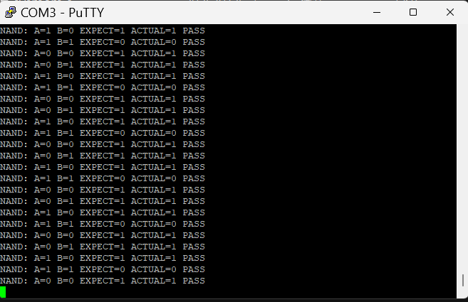

# STM32 74HC00 單閘邏輯功能測試器

使用 NUCLEO-G474RE 開發板，自動產生測試輸入、讀取 74HC00 的輸出，並透過 UART 回報 PASS／FAIL，完成單一 NAND 閘的靜態邏輯功能驗證。

## 專案狀態

- 已完成第一個 NAND 閘的四組輸入測試。
- 已觀察到連續多輪四組測試皆通過。
- 程式原始碼與實測圖片將陸續整理上傳。

## 功能

- 自動產生 00、01、10、11 四組邏輯輸入。
- 讀取待測 IC 的邏輯輸出。
- 比較預期值與實際值，判定 PASS／FAIL。
- 透過 UART 輸出測試結果。
- 循環執行測試。

## 使用硬體與工具

- NUCLEO-G474RE 開發板
- 74HC00 四組二輸入 NAND 閘 IC
- 麵包板與杜邦線
- USB 連接線
- STM32CubeIDE
- 串列終端機軟體，例如 PuTTY

## 接線方式

待測 IC 使用 3.3V 供電，測試第一個 NAND 閘。

| 訊號 | STM32 腳位／電源 | 74HC00 接腳 |
|---|---|---|
| DUT_A | PA0 | 第 1 腳：1A |
| DUT_B | PA1 | 第 2 腳：1B |
| DUT_Y | PB0，開發板 A3 接孔 | 第 3 腳：1Y |
| VCC | 3V3 | 第 14 腳：VCC |
| GND | GND | 第 7 腳：GND |

> PA0、PA1 的實際排座位置請依開發板腳位圖核對；PB0 在本次接線中使用 A3，並非 A4。

### GPIO 設定

| 訊號 | 設定 |
|---|---|
| DUT_A／PA0 | Output Push-Pull |
| DUT_B／PA1 | Output Push-Pull |
| DUT_Y／PB0 | Input with Pull-down |

### 接線注意事項

- 先斷電，再更改接線。
- 確認 IC 缺口方向與腳位編號。
- 開發板與待測 IC 必須共地。
- 未使用的 CMOS 輸入應接固定高或低電位，不可浮接；未使用的輸出可留空。
- 建議在 IC 的 VCC 與 GND 之間加入 100 nF 陶瓷去耦電容，並縮短連線。
- 若發生過電流警示或異常發熱，立即斷電檢查。

## 測試流程

1. 初始化 GPIO 與 UART。
2. 將一組測試輸入輸出至 DUT_A、DUT_B。
3. 等待訊號穩定後讀取 DUT_Y。
4. 將讀值與 NAND 真值表比較。
5. 透過 UART 顯示結果。
6. 繼續下一組輸入，完成四組後循環測試。

## 測試結果

在 3.3V 供電條件下，第一個 NAND 閘的測試結果如下：

| 輸入 A | 輸入 B | 預期輸出 | 實際輸出 | 結果 |
|---|---|---|---|---|
| 0 | 0 | 1 | 1 | PASS |
| 0 | 1 | 1 | 1 | PASS |
| 1 | 0 | 1 | 1 | PASS |
| 1 | 1 | 0 | 0 | PASS |

### UART 實測截圖

以下為 PuTTY 接收的 UART 測試紀錄。畫面中可見 00、01、10、11 四組輸入的實際輸出皆符合 NAND 真值表，並連續多輪顯示 PASS。

> 本結果僅代表單一 NAND 閘在本次測試條件下通過靜態邏輯功能驗證。

## 除錯紀錄

### 輸出讀值持續為 0

- 現象：部分輸入組合的預期輸出為 1，但 STM32 讀值持續為 0。
- 排查：確認 GPIO 設定、程式讀取腳位與實體接線。
- 原因：74HC00 的 1Y 誤接至 A4，未接至程式使用的 PB0／A3。
- 修正：將 1Y 改接 A3 後，四組輸入測試皆通過。

### 供電異常

- 過程中曾出現過電流／異常發熱情況。
- 斷電檢查並修正接線後，供電恢復正常。
- 後續操作採取「斷電改線、確認後再上電」的原則。

## 專案成果與學習重點

- 建立測試向量、輸出讀取、結果比較與回報的自動化流程。
- 使用 STM32 HAL 控制 GPIO 與 UART。
- 理解 NAND 真值表與基本數位邏輯測試。
- 分辨 MCU 腳位名稱與開發板接孔標示。
- 透過供電、接線與程式逐層排查硬體整合問題。

## 目前限制

- 僅測試 74HC00 的第一個 NAND 閘，並非四個閘全部驗證。
- 僅驗證指定條件下的靜態邏輯功能。
- 未量測傳播延遲、輸出驅動能力或完整電氣規格。
- PASS 代表通過本次功能測試，不代表整顆 IC 的所有規格皆合格。

## 未來擴充

- 完成 74HC00 四個 NAND 閘的測試。
- 加入按鍵啟動及整體 PASS／FAIL 指示。
- 累計測試次數並記錄失敗明細。
- 支援其他基本邏輯 IC。
- 建立固定接線治具與保護電路。
- 將測試資料保存為 CSV。
